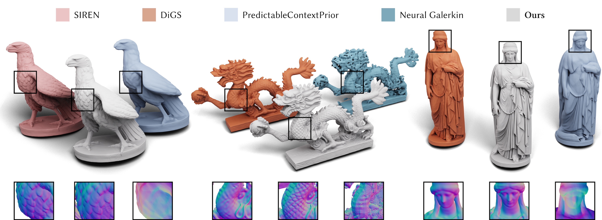

# Neural-Singular-Hessian

Code of Neural-Singular-Hessian: Implicit Neural Representation of Unoriented Point Clouds by Enforcing Singular Hessian. ACM Transactions on Graphics (SIGGRAPH Asia 2023).

[Arxiv](https://arxiv.org/abs/2309.01793)



### 1. Requirements

Our cod uses [PyTorch](https://pytorch.org/).

The code was tested with Python 3.8, torch 1.31.1, CUDA 11.6 on Ubuntu 18.04.

Using conda to create the environment and activate it.

```bash
conda env create -f env.yaml
conda activate neural_singular
```

### 2. Overfitting Single Shape

1. Put your data to ./data/sdf/input, some data already exists

2. Switch to the folder surface_reconstruction, run ./run_sdf_recon.py to reconstruct the surface. **The script will reconstruct all shapes under the ./data/sdf/input (*.xyz and *.ply) files**

```
cd surface_reconstruction
python run_sdf_recon.py
```

**Results mesh are saved in ./surface_reconstruction/log/sdf/result_meshes**

### 3. Shape Space Learning with DFaust

We use [pytorch-lightning](https://lightning.ai/) for shape space shape learning. Note that the newest version may not be compatible with our code.

#### 3.1 Data Preparation

Refer to [DOGNN](https://github.com/microsoft/DualOctreeGNN#4-unsupervised-surface-reconstruction-with-dfaust) to prepare your data.

Change 'dataset_path', 'train_split_path' and 'test_split_path' in shapespace/shapespace_dfaust_args.py to your DOGNN path based default settings

#### 3.2 Train

#### 3.3 Test and Fine-tuning

#### 3.4 Pretrained models

### 4. Evaluation

For evaluation of results, [POCO](https://github.com/valeoai/POCO) has provided a great script based on [ConvONet](https://github.com/autonomousvision/convolutional_occupancy_networks). Please refer to their [code](https://github.com/valeoai/POCO/blob/main/eval/src/eval.py).

### Acknowledgements

This code is heavily based of [DiGS](https://github.com/Chumbyte/DiGS) and [idf](https://github.com/yifita/idf).

Thanks to their impressive works.

### Bibtex

```bash
@article{zixiong23neuralsingular,
author = {Zixiong Wang, Yunxiao Zhang, Rui Xu, Fan Zhang, Pengshuai Wang, Shuangmin Chen, Shiqing Xin, Wenping Wang, Changhe Tu},
title = {Neural-Singular-Hessian: Implicit Neural Representation of Unoriented Point Clouds by Enforcing Singular Hessian},
year = {2023},
journal = {ACM Transactions on Graphics (TOG)},
publisher = {Association for Computing Machinery},
address = {New York, NY, USA}
}
```


